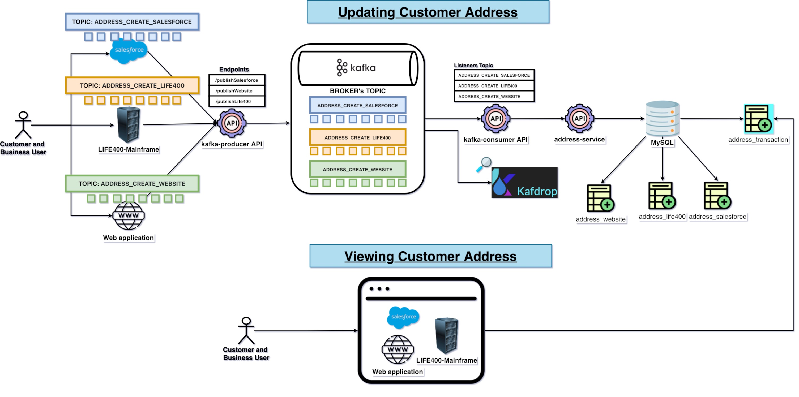
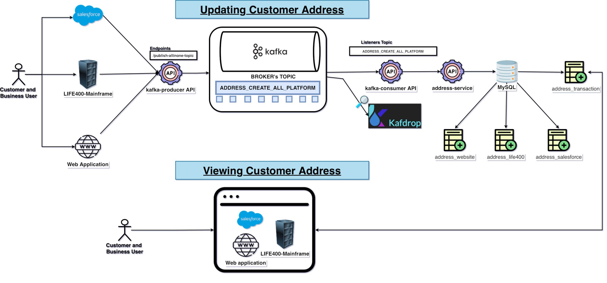
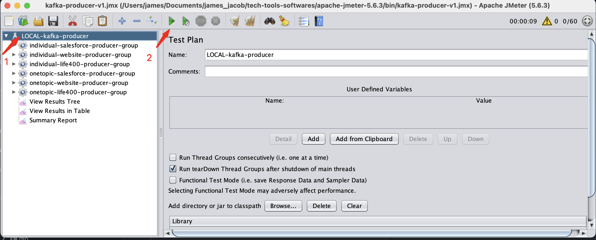
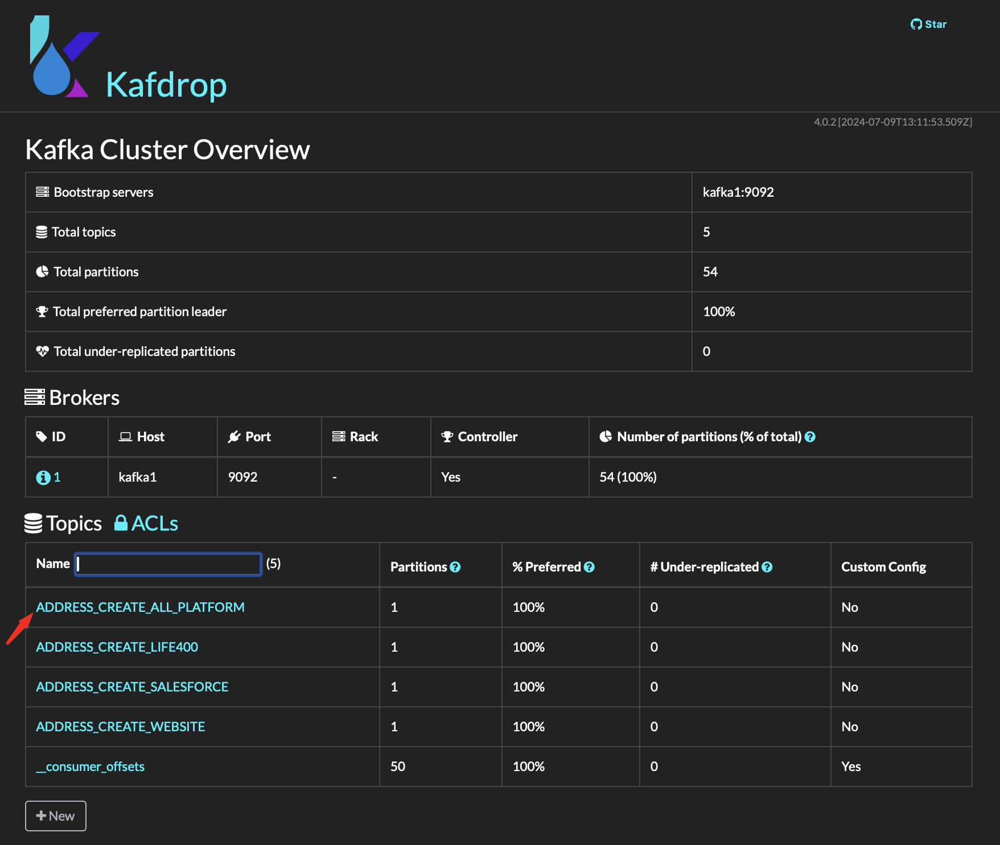
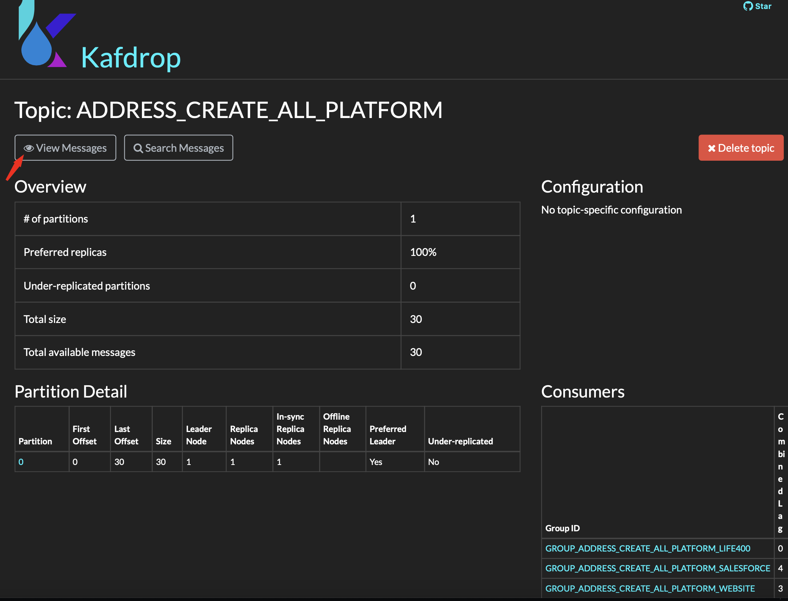
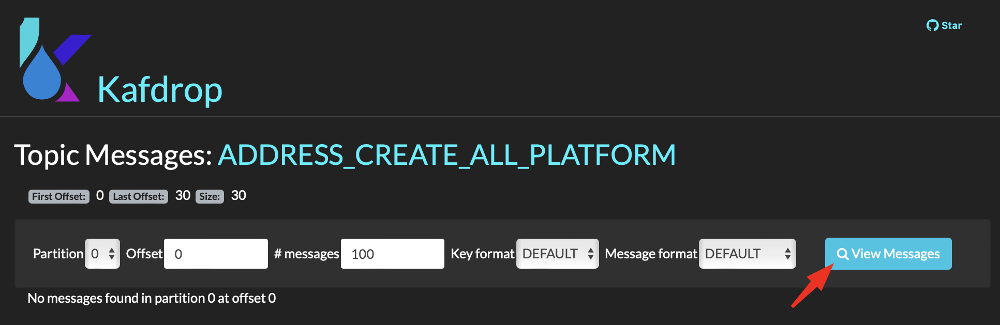
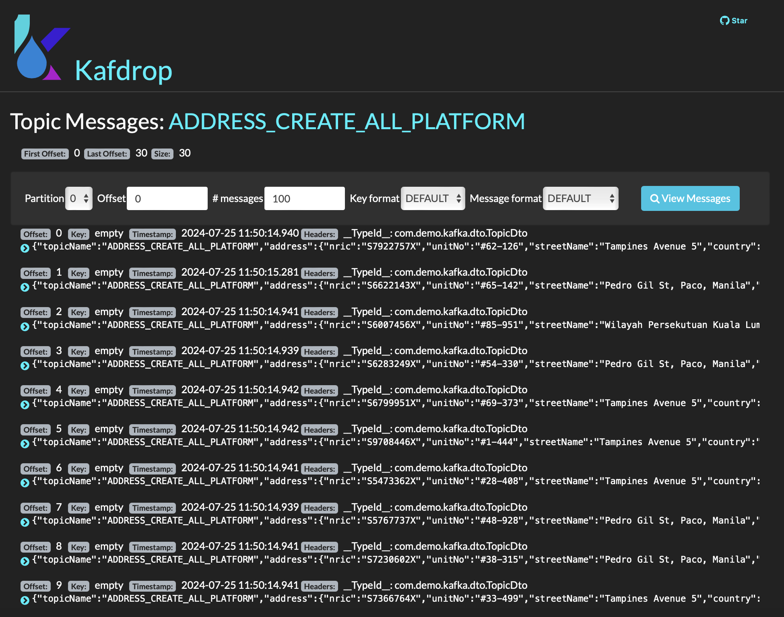
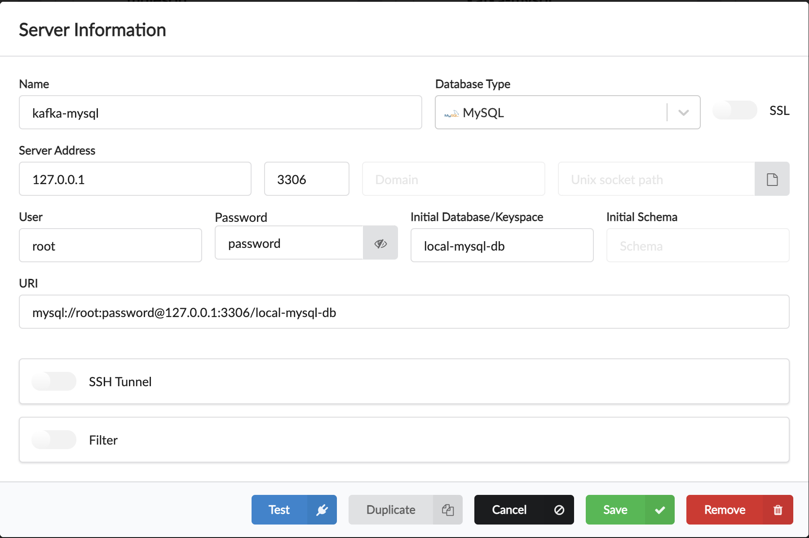
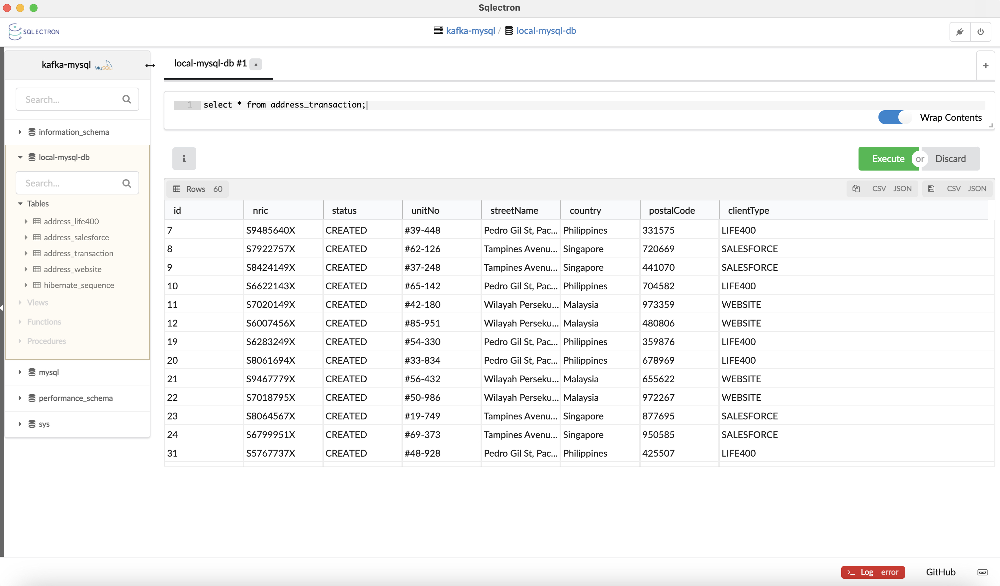

# Spring Boot, Kafka, Zookeeper, Kafdrop, Spring Data/JPA, MySQL, Rest API
## Sample kafka-project
- Kafka as a traditional message broker. One topic per platform.
- Single topic for all platforms but with different clientType. To be processed separately using recordFilterStrategy.

### Use Cases(Address creation)
* In the insurance domain, multiple platforms are able to update customer information, like addresses:
  * Website application
  * Salesforce
  * Life400 - mainframe
* Use kafka to receive and process all ADDRESS creation from multiple platforms and process to the downstream services.
* Introduced address_transaction which will be refer by the consumers

### Use Case #1
* Kafka as traditional message broker.
  * One topic per platform
    * ADDRESS_CREATE_SALESFORCE
    * ADDRESS_CREATE_WEBSITE
    * ADDRESS_CREATE_LIFE400
  * One producer endpoint per platform/topic.
  * One consumer listener per platform/topic.
* Sample architecture diagram
  

### Use Case #2
* Kafka single topic with consumer using recordFilterStrategy.
  * One topic for all platforms with different clientType.
    * ADDRESS_CREATE_ALL_PLATFORM
  * One producer endpoint to all platform.
  * One consumer listener per platform clientType by using recordFilterStrategy.
    * containerFactory = "allPlatformSalesforceFactory"
    * containerFactory = "allPlatformWebsiteFactory"
    * containerFactory = "allPlatformLife400Factory"
* Sample architecture diagram
* 


### Prerequisite on running this project:
- Install Java 11(Needed by Kafkdrop - kafka message viewer).
- Install Docker Desktop.
- JMeter - for testing.

### Tech stack and services in kafka-project.
- kafka
- zookeeper
- Kafkdrop - kafka message viewer
- kafka-producer service
- kafka-consumer service
- address-service - services to process consume messages
- MySql - to save all transactions

### Steps in running kafka-project.
- Checkout the project in Github.
- Go the project directory.
```bash
cd /<path>/kafka-project
```
- Install kafka-project services.
```bash
mvn clean install
```
- Start kafka-project services.
```bash
docker-compose up
```
- View Kafdrop on the browser using the below URL.
```bash
http://localhost:9000
```

### Testing kafka-project locally.
- Copy the JMeter script to JMeter bin directory.
```bash
JMeter script - kafka-project/_external_files/kafka-producer-v1.jmx
JMeter bin - <JMeter path>/bin
cp <JMeter script> <JMeter bin>
```
- Open JMeter interface. No need to run in non-GUI mode.
```bash
cd <JMeter bin>
./jmeter.sh
```
- Execute JMeter script.
- 

### View Kafka messages using Kafdrop.
- 
- 
- 
- 

### View the address records.
- Setup MySQL client.
- 
- Verify the data.
- 